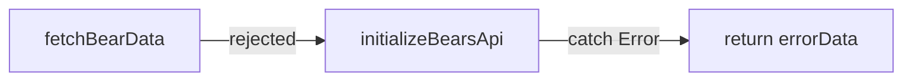

# Table of Contents
- [Playground 1](#playground-1)
  - [Task 1](#task-1)
  - [Task 2](#task-2)
  - [Task 3](#task-3)

# Playground 1

## Task 1
### How does an ES module differ from a classic script with respect to scope, strict mode, loading, and bindings? Explain why the module boundaries you chose make the application easier to maintain.

#### Classic Script
- puts everything in global scope
- for strict mode a 'use strict' is necessary
  - strict mode -> security rules which indicate silent errors, implicit global variables, etc.
- block the parser
- copy values

#### ES modules
- ECMAScript modules: standard for modularizing JavaScript code
- have their own scope
  - nothing is exposed unless it is explicitly exported
- strict mode is enabled by default
- load asynchronously and respect dependency graphs via 'import'
- use 'live bindings', meaning imports always reflect the current exported
  - when one module exports a function, that another module imports, the connection is "live", which means that the import is not a "snapshot", its a reference to the exported value

#### Maintainability Improvements (ES modules)
- each module has one clear responsibility
- no accidental global variables
- isolated modules
  - easier to test
  - easier to refactor or change rendering/data logic without touching unrelated paths
- dependency graph is clear and explicit (import/export)

## Task 2

### Describe event propagation (capturing, target, and bubbling). Where could event delegation be useful in this application, and what trade-off would it introduce?

#### Event Propagation
Event propagation describes how an event flows through the DOM tree. It consists of three phases:
1. **Capturing Phase**: The event starts from the root of the DOM tree and travels down to the target element. During this phase, event listeners registered for the capturing phase can intercept the event before it reaches the target (indicated via capture: true in .addEventListener(...)).
2. **Target Phase**: The event reaches the target element, and any event listeners registered on the target element are executed.
3. **Bubbling Phase**: After the target phase, the event bubbles back up through the DOM tree back to the root. This phase is mostly used in this application (default for .addEventListener(...))

#### Event Propagation – Visualize
1. **Capturing Phase**: Parent → Child / Top down
2. **Target Phase**: Child / directly on the target element
3. **Bubbling Phase**: Child → Parent / Bottom up

#### Event Delegation
Event delegation describes, that a listener is not attached to each element itself, but to a common parent, which captures all events in the **Bubbling Phase**.
This is especially useful for dynamic elements (because you do not want to place a listener on each dynamic element) and therefore for the **'more_bears'** section in our application, as bears are dynamically created depending on the API response.

#### Event Delegation – Trade Offs
  - handling of events is more complex, because it is not implicitly clear which element triggered the event
  - when you have deeply nested DOM trees, it could be difficult to determine where the event is captured (to which parent it is delegated)

## Task 3

### How do synchronous exceptions and rejected promises travel through this application? Explain where errors should be caught and why catching every error at its source can make failures harder to diagnose.

#### Application Flow
In this application, we have following exception flow (bears.js):
- ``initializeBearsApi()`` calls ``fetchBearData()``
- ``fetchBearData()`` creates a promise
- this promise may be rejected (corrupt JSON, network error, API down, etc.)
- promise goes as 'rejected promise' back to ``initializeBearsApi()``
- ``initializeBearsApi()`` catches error, prints it to the console and returns mock data, which displays placeholder images (as an excuse) and information that the API is down

#### Catching errors
When each error is caught at its source, it can make failures harder to diagnose, because the error may be coming from:
- network
- API
- JSON parsing
- Regex
- Logic
- etc.

This also makes debugging very hard & time-consuming.
For example, when each layer returns some fallback data, it is not clear where the error originated from, and the error may be lost in the process.
When doing this too often, the application always looks like it is working, but consists of invisible errors, which are hidden from the user.

It is better practice to catch errors at a higher level, where the error can be displayed/logged and replaced with fallback data.
Synchronous exceptions: try/catch blocks, when try block fails, then catch block is executed
Rejected promises: when something fails, Promise.reject() is called, which is returned to the caller (higher level), which can then either handle the exception or pass it further up the call stack.

