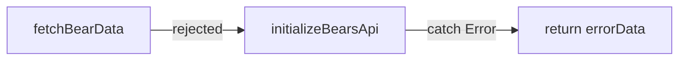

# Table of Contents
- [Playground 1](#playground-1)
  - [Task 1](#task-1--introduce-es-modules)
  - [Task 2](#task-2--correct-the-application-behavior)
  - [Task 3](#task-3--make-failures-explicit)
  - [Task 4](#task-4--refactor-asynchronous-control-flow)
  - [Task 5](#task-5--remove-remaining-code-smells)
- [Playground 2](#playground-2)
  - [Task 1](#task-1--establish-the-build)
  - [Task 2](#task-2--migrate-to-typescript)

# Playground 1

## Task 1 – Introduce ES modules
### How does an ES module differ from a classic script with respect to scope, strict mode, loading, and bindings? Explain why the module boundaries you chose make the application easier to maintain.

#### Classic Script
- puts everything in global scope
- for strict mode a 'use strict' is necessary
  - strict mode -> security rules which indicate silent errors, implicit global variables, etc.
- block the parser
- copy values

#### ES modules
- ECMAScript modules: standard for modularizing JavaScript code
- have their own scope
  - nothing is exposed unless it is explicitly exported
- strict mode is enabled by default
- load asynchronously and respect dependency graphs via 'import'
- use 'live bindings', meaning imports always reflect the current exported
  - when one module exports a function, that another module imports, the connection is "live", which means that the import is not a "snapshot", its a reference to the exported value

#### Maintainability Improvements (ES modules)
- each module has one clear responsibility
- no accidental global variables
- isolated modules
  - easier to test
  - easier to refactor or change rendering/data logic without touching unrelated paths
- dependency graph is clear and explicit (import/export)

## Task 2 – Correct the application behavior

### Describe event propagation (capturing, target, and bubbling). Where could event delegation be useful in this application, and what trade-off would it introduce?

#### Event Propagation
Event propagation describes how an event flows through the DOM tree. It consists of three phases:
1. **Capturing Phase**: The event starts from the root of the DOM tree and travels down to the target element. During this phase, event listeners registered for the capturing phase can intercept the event before it reaches the target (indicated via capture: true in .addEventListener(...)).
2. **Target Phase**: The event reaches the target element, and any event listeners registered on the target element are executed.
3. **Bubbling Phase**: After the target phase, the event bubbles back up through the DOM tree back to the root. This phase is mostly used in this application (default for .addEventListener(...))

#### Event Propagation – Visualize
1. **Capturing Phase**: Parent → Child / Top down
2. **Target Phase**: Child / directly on the target element
3. **Bubbling Phase**: Child → Parent / Bottom up

#### Event Delegation
Event delegation describes, that a listener is not attached to each element itself, but to a common parent, which captures all events in the **Bubbling Phase**.
This is especially useful for dynamic elements (because you do not want to place a listener on each dynamic element) and therefore for the **'more_bears'** section in our application, as bears are dynamically created depending on the API response.

#### Event Delegation – Trade Offs
  - handling of events is more complex, because it is not implicitly clear which element triggered the event
  - when you have deeply nested DOM trees, it could be difficult to determine where the event is captured (to which parent it is delegated)

## Task 3 – Make failures explicit

### How do synchronous exceptions and rejected promises travel through this application? Explain where errors should be caught and why catching every error at its source can make failures harder to diagnose.

#### Application Flow
In this application, we have following exception flow (bears.ts):
- ``initializeBearsApi()`` calls ``fetchBearData()``
- ``fetchBearData()`` creates a promise
- this promise may be rejected (corrupt JSON, network error, API down, etc.)
- promise goes as 'rejected promise' back to ``initializeBearsApi()``
- ``initializeBearsApi()`` catches error, prints it to the console and returns mock data, which displays placeholder images (as an excuse) and information that the API is down



Addition: Task 5 –  when `fetchWikipediaAPI()` fails, it returns a rejected promise to the function that called it, for example `fetchBearWikitext()`.
`fetchBearWikitext()` then (due to `await`) passes the rejected promises further above to `initializeBearsApi()`, which then throws an error 
and is caught in the `try/catch` block of `initializeBearsApi()`. Here, the error is logged and handled (by returning placeholder errorData).
Generally, when a promise is rejected, it throws an error at the point where it was awaited (same as if you would write `throw new Error(...)`, which can be caught in a `try/catch` block.

#### Catching errors
When each error is caught at its source, it can make failures harder to diagnose, because the error may be coming from:
- network
- API
- JSON parsing
- Regex
- Logic
- etc.

This also makes debugging very hard & time-consuming.
For example, when each layer returns some fallback data, it is not clear where the error originated from, and the error may be lost in the process.
When doing this too often, the application always looks like it is working, but consists of invisible errors, which are hidden from the user.

It is better practice to catch errors at a higher level, where the error can be displayed/logged and replaced with fallback data.
Synchronous exceptions: try/catch blocks, when try block fails, then catch block is executed
Rejected promises: when something fails, Promise.reject() is called, which is returned to the caller (higher level), which can then either handle the exception or pass it further up the call stack.

## Task 4 – Refactor asynchronous control flow

### Explain the relationship between async/await, promises, the microtask queue, and the browser event loop. Also explain why an arrow function is not always an interchangeable replacement for a regular function, particularly regarding this.

#### Promise
A promise represents a value that will be available later. Basically, it just defines that at some time a value will be there.
When it is resolved or rejected, the callbacks (``.then()``, ``.catch()``) do not run immediately – they are placed into the **microtask queue**.
Promise callbacks always run **AFTER** the current synchronous code, but before any regular events.

#### Async/Await
Syntactic addition for promises. ``await`` schedules the continuation (``.then()``, ``.catch()``) as a microtask.
```javascript
const result = await fetch(url)
// is the same as
fetch(url).then(response => {})
```

#### Microtask Queue
The microtask queue is a high-priority queue used for promise callbacks and async/await continuations.
The execution within the browser follows this order:

1. Run all synchronous code
2. Run all microtasks (Promises, async/await)
3. Render updates
4. Run macrotasks (setTimeout, setInterval, I/O, events)

#### Browser Event Loop
The event loop coordinates the call stack, microtask queue, macrotask queue, rendering.
It ensures that JavaScript appears as asynchronous, even though it is single-threaded.

#### Arrow Functions vs Regular Functions
A big difference between arrow functions and regular functions comes down to the ``this`` keyword.
For a **Regular Function** the ``this`` keyword refers to the surround lexical scope.
```javascript
button.addEventListener('click', function () {
    this.classList.add('active'); // this = button
});

```
For an **Arrow Function** the ``this`` keyword is lexically bound to the surrounding context where the arrow function was defined.
```javascript
button.addEventListener('click', () => {
    this.classList.add('active'); // this ≠ button
});
```

For example, when async code resumes, and the value of ``this`` is used and it refers to the wrong context (due to arrow/regular function),
it could be difficult to debug.
This happens, as the error appears asychronously and the stack trace points to the microtask continuation and not the original call.

Another difference is that **Arrow Functions** do not have own ``arguments``.
```javascript
// Regular
function log() {
    console.log(arguments);
}
// Arrow
const log = () => {
  console.log(arguments); // ReferenceError
};
```

## Task 5 – Remove remaining code smells

### Select one of your refactorings and explain how JavaScript scope, closures, references, or prototypes caused the original risk. State how you verified that your refactoring preserved behavior.

#### Bear API
The original implementation consisted of a single function that both fetched and parsed data, which violated the Single Responsibility Principle. It was therefore split up into several smaller functions, each handling one concern.
Another refactoring extracted the placeholder error data into a separate module, in order to separate data from logic.
The `fetch()` logic was also refactored, since it was duplicated across two places. It was extracted into a shared function that takes `params as an argument.

```javascript
// Example Duplicated Code

// Before
const fetchBearData = async () => {
  // Fetching bear data
  const params = {
    // ... 
  };
  // ...
  const response = await fetch(url);
  const data = await response.json();
  // ...
};

const fetchImageUrl = async (fileName) => {
  // ...
  const imageParams = {
    // ...
  };
  // ...
  try {
    const response = await fetch(url);
    const data = await response.json();
    // ...
  } catch (error) {
    // ...
  }
}

// After
// shared function
async function fetchWikipediaApi(params) {
  const url = BASE_URL + "?" + new URLSearchParams(params).toString();
  const response = await fetch(url);
  return await response.json();
}

```

```javascript
// Example Single Responsibility Principle
// Before
export function initializeSearch() {
  // search highlights
  // remove highlights
  // get search key
  // ...
    function highlightSearchKey(node) {
      // ... highlight nodes
    }
  // ...
}

// After
export function initializeSearch() {
  // ...
  removeHighlights()
  // ...
  document.querySelectorAll('article').forEach(article => highlightNode(article, regex));
}

function removeHighlights() {}
function highlightNode(node, regex) {}
```


#### Search
The Single Responsibility Principle was violated here as well, so the relevant logic was extracted into a separate method.
Directly iterating over `node.childNodes` created a risk, since `node.childNodes` is a live snapshot of the current state rather than a fixed copy.
Within the same function, nodes were being manipulated and new nodes were potentially added (when highlighting text), changing `node.childNodes` during iteration, which could lead to unexpected behavior or bugs.
To prevent this, a copy of `node.childNodes` was created before iterating, ensuring that the iteration ran over a static snapshot of the nodes instead.

```javascript
// iterating over live snapshot (unexpected behavior possible)
node.childNodes.forEach(highlightSearchKey);

// iterating over static snapshot
Array.from(node.childNodes).forEach(child => highlightNode(child, regex));
```


#### Comments
Only refactoring regarding consistency took place.

#### Bears List
Another risk was found here. Previously, each bear was created and added to the DOM separately.
As a result, each bear triggered a reparsing and rerendering of all previously inserted bears (the HTML was completely rebuilt on each iteration).
This negatively impacts the overall performance (with each new bear, all old bears also need to be recreated) → O(n²) complexity
Therefore, the full HTML is now built at once using `map`and `join`and after that written to `innerHTML` to trigger one single DOM update. (one instead of n DOM updates with n bears)

```javascript
// each iteration triggers rerendering of all previously inserted bears
bears.forEach(bear => {
        moreBears.innerHTML += `
            <div class="bear">
                
                <p><b>${bear.name}</b> (${bear.binomial})</p>
                <p>Range: ${bear.range}</p>
            </div>
        `;
    });

// build full html at once and then write to innerHTML to trigger one single DOM update
const html = bears.map(bear => `
        <div class="bear">
            
            <p><b>${bear.name}</b> (${bear.binomial})</p>
            <p>Range: ${bear.range}</p>
        </div>
    `).join("")

moreBears.innerHTML = html;
```

# Playground 2

## Task 1 – Establish the build

### Distinguish source, build, distribution, and deployment. What does your build tool do in development and in a production build, and why is the lockfile important for reproducibility?

#### Source, Build, Distribution & Deployment
- **Source**
  - Code written in `/src` folder. Often ES modules and often not directly runnable in browsers as they are.
- **Build**
  - Process of transforming the source code into a runnable format. Modules are bundled together, transpiled to older JavaScript versions, minified, etc.
- **Distribution**
  - Output of the **build** process. Often stored in `/dist` folder. Contains static, ready-to-go files (HTML, CSS, JS). 
    They are always generated from the source code and never manually edited.
- **Deployment**
  - Process of pushing the **distribution** files to a server or hosting platform, where end users have the ability to access them.

#### Build Tool – Vite

- **Development**
  - Started with `npx vite`
  - Vite serves source files using ES module imports in the browser, only transforming code on the fly when requested.
  - Server starts almost instantly – no full bundling is done.
  - Changes are seen via **Hot Module Replacement** (full page reload not needed)
  - Priority lies in speed and debugging
  
- **Production**
  - Started with `npx vite build`
  - Vite bundles all modules together, removes unused code (tree-shaking), minifies the output and adds content hashes to filenames (purpose of caching).
  - Priority lies in producing the smallest, fastest-loading and production-ready files.

#### Importance of `package-lock.json`
`package.json` usually specifies version ranges (for example `^2.1.0`, which means `2.1.0` or newer, but only minor and patch versions, not `3.0.0` or newer).
`package.json` possible version prefixes:
- `^` – only minor and patch versions
- `~` – only patch versions
- `>` or `>=` or `<` or `<=` – any version greater or smaller than the specified one
- `=` – exact version
- `*` or `x` – any version (also `4.x` possible)
- `-` – any version in a specified range
- `||` – OR relationship (one of the specified versions must be satisfied)

`package-lock.json` defines the exact resolved versions of every dependency in the full dependency tree. By running `npm ci` anywhere, it is guaranteed that the exact same `node_modules` are produced.
Without the use of a lockfile, in different environments (local, server, other developer, etc.) different setups may consist of different versions as `package.json` only specifies a range.
This could potentially lead to bugs or unexpected behavior.
This is the reason why `package-lock.json` is important for reproducibility and therefore commited to the repository.


## Task 2 – Migrate to TypeScript

### TypeScript uses structural typing and erases types during compilation. Explain both concepts and why a compile-time type alone cannot guarantee the shape of a Wikipedia API response at runtime.

#### Structural Typing
TypeScript checks types based on their structure rather than their name. If a value has all
required properties with the correct types, it is considered to be of that type, regardless of
how it was declared or where it came from.
In contrast, nominal typing (Java, C#) requires a class to explicitly declare that it implements or extends a type.

#### Type Erasure
Types only exist at compile time. When TypeScript is translated to JavaScript, the compiler removes all annotations, interfaces and generics completely.

#### Why a compile-time type alone cannot guarantee the shape of a Wikipedia API response
The compiler only knows the source code, not what `fetch` returns at runtime. Therefore,
`response.json()` returns `Promise<any>`. In the generic implementation, the result is cast
`as T`:

```typescript
return (await response.json()) as T;
```

This is only an assertion to the compiler, which trusts it without checking, because it has no access to the runtime data. Due to type erasure, `T` does not even exist at runtime, so no
check could happen there anyway. If Wikipedia sends something different (a missing property, a changed format, an error object), the code still compiles but fails at runtime, e.g. with `Cannot read properties of
undefined`. The type only describes what we expect, not what actually arrives.

Therefore, data from external sources must be checked at runtime (e.g. with type guards or
a schema library) before it is treated as **typed**.

## Task 3 – Add static analysis and formatting

### What different problems do a linter, a formatter, and the TypeScript compiler detect? Give one concrete example for each from this project.

#### Linter
A linter detects risky or inconsistent code patterns that are still valid TypeScript. Example from this project: in `parseBear`, the check `if (!name || !binomial || !image)` compiles, but the rule `strict-boolean-expressions` (part of `standard-with-typescript`) reports the implicit check on a `string | undefined`. It also hides a subtle behavior: an empty string is treated as a missing value.

#### Formatter
A formatter only detects deviations in layout, never in behavior. Example from this project: the code was indented with 4 spaces, but the prescribed Prettier config uses `tabWidth: 2`. Prettier reports `Delete ····` on nearly every line and would also replace `"` with `'` because of `singleQuote: true`. The program behaves exactly the same before and after formatting.

#### TypeScript Compiler
The compiler detects type errors, meaning values that are used in a way their types do not allow. Example from this project: `fetchImageUrl` was declared as `Promise<ImageInfoResponse>`, but it returns a URL, which is a `string`. The compiler reports that `string` is not assignable to `ImageInfoResponse`. Similarly, `nameField.value` fails because `querySelector` returns `Element | null`, and `Element` has no property `value`.